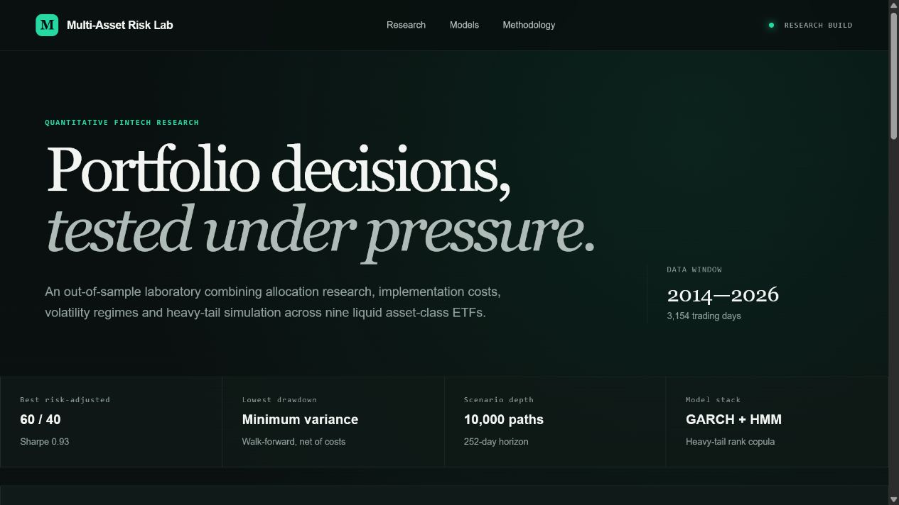
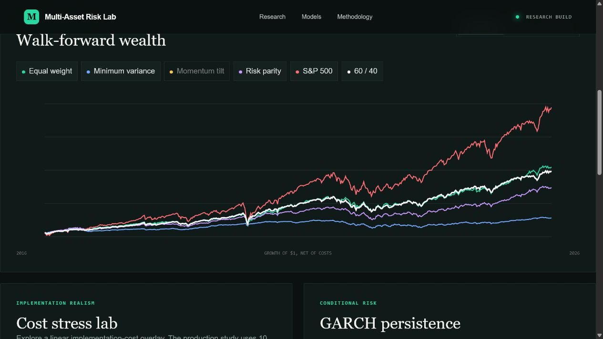

# Multi-Asset Risk Lab Dashboard

The dashboard is the interactive front end for the repository's walk-forward portfolio study. It reads the production research payload generated by `research_pipeline.py` and presents strategy wealth, benchmark comparisons, tail-model results, GARCH persistence, and transaction-cost sensitivity in one responsive view.





## What it shows

- Walk-forward wealth for four allocation strategies, the S&P 500, and a 60/40 benchmark
- Historical block-bootstrap versus GARCH–regime–t-copula tail estimates
- A cost-stress control that illustrates the effect of higher implementation friction
- Per-asset GARCH persistence and concise explanations of the validation design

The UI does not calculate research results in the browser. `public/results.json` is produced by the Python pipeline, which keeps model logic testable and prevents the displayed numbers from drifting away from the documented experiment.

## Run locally

Requirements: Node.js 22.13 or newer and pnpm.

```bash
pnpm install
pnpm dev
```

Open the local URL printed by the development server.

## Validate

```bash
pnpm test
```

The test command builds the deployable worker, verifies the rendered application shell, rejects leftover starter branding, and checks that the research payload contains the expected production models and 10,000-path configuration.
